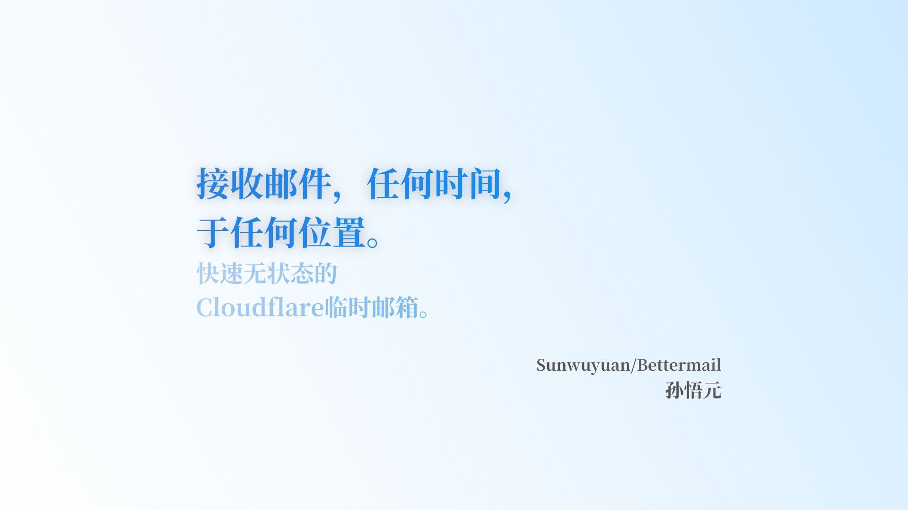

# Bettermail 🍥

你看雪花飘散。

快速、无状态的收信、获取内容并随即删除。

## 推荐部署：粘贴 JS

1. 打开 [Releases](../../releases)，下载 **`bettermail-v*.js`**，去Cloudflare中创建worker粘贴。
2. 绑定存储二选一：
   - **D1**：名称为 `DB`
   - **KV**：名称为 `BMAIL`
3. （可选）**Settings → Variables and Secrets** → `API_TOKEN`
4. （可选）同处设置 `ALLOW_LIST_ALL=1` 才允许不传 `to` 拉取全部邮箱；默认禁止
5. 你的域名的设置 → **Email Routing** → Catch-all → **Send to a Worker** → 该 Worker

## 文档、AI提示词
[在线文档](https://bmail.apifox.cn/)

其他可以直接复制给AI的提示词：
[AI提示词](/AI)

声明：本项目仅用于个人学习使用，请勿用于违法行为，开发者不对任何使用本项目的行为负责，开发者不会也无权查看您的私人邮箱内容，请积极协助您的邮件服务商履行监管义务。

此外，开发喵特别授权您在 issue 中抚摸（不包括:揉捏、拉拽、提起、~~淫虐~~）开发者猫耳的自由。[去摸](https://github.com/Sunwuyuan/Bettermail/issues/new?template=摸摸开发者的猫耳.md)

本项目曾在 [LINUX DO](https://linux.do/u/wuyuan/summary) 推广过。